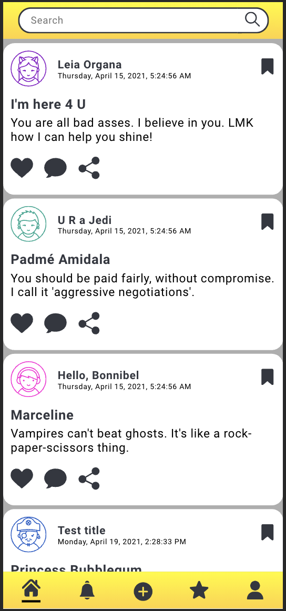

# Shine

  

## Table of Contents

- [About the Project](#about-the-project)
  - [Final Product](#final-product)
- [Project Goals](#project-goals)
- [Installation](#installation)
- [Technologies Used](#technologies-used)
- [Wireframes](#wireframes)
- [Functionality](#functionality)
  - [General](#general)
  - [Search](#search)
  - [Reply](#reply)
  - [Error Handling](#error-handling)
- [Contact the Contributers](#contact-the-contributers)

## About the Project

Currently, only 14% of the total software engineering workforce is women. Women also leave the tech industry at a 45% higher rate than men(https://lnkd.in/eG7ssiA). Shine, or SHE in Engineering, is a mobile application that will serve as a platform for women in (or interested in) software engineering to support one another. Shine provides a safe space for women to post their questions or concerns and receive feedback from other women.

This project allowed our team to select a technology that is not taught in the Turing curriculum. Our team chose to study TypeScript and Express. Through research, struggle, and grit, we were able to create Shine and learn a lot about our own individual learning processes.

Project spec ->
https://frontend.turing.edu/projects/module-3/stretch.html

#### Final Product:
##### Loading Page:

##### Home Page:

##### Replies Page:

## Project Goals
1. Gain competency with React and create multipage using Router.
2. Learn and implement TypeScript on front-end and back-end.
3. Utilize Express to create a fully functional API.
4. Make network requests to API endpoints to retrieve and manipulate data.
5. Use Object Oriented Programming (OOP) to drive the design of the application and the code.
6. Create a testing using Cypress that thoroughly tests all the functional aspects of the application.
7. Ensure the app is following best accessibility practices.
8. Leverage SASS to DRY up CSS.

## Installation
View the code ->

Front-End:
https://github.com/PaigeVannelli/shine

API:
https://github.com/piknikki/shine-api

Deployed Link ->
https://shine-api.herokuapp.com/api/v1/posts/

## Technologies Used

- 

- 

- 

- 

- 

- 

- 

- 

## Wireframes
Sketch was utilized to create wireframes, low fidelity, and high fidelity prototypes. We tested all user stories with our wireframes/prototypes to ensure that our designs catered to the needs of our users.

## Functionality

#### General
Shine is a mobile application that supports women in software engineering or interested in becoming a software engineer. A user can add a post to the home page where other users can reply to the posed question. 

#### Adding a Post

#### Search
Users can also search through previously posted questions by using the search bar.

#### Error Handling
Error handling was considered when building the website. A loading screen will appear when any content is not appearing and is still rendering. When a user wants to submit a post or reply, they must fill out the required fields in order for the button to activate. The user will know that the button is activated because it turns a gradient yellow. As an extra precaution, error messages have been built in just in case the button is activated when it shouldn't be.

#### Accessibility
Shine received a 100% from Lighthouse on Accessibility. Users can tab throughout the full application, making it accessible for those using keyboards to navigate through.

## Contact the Contributers
[][linkedin]
[][github]

[][linkedin2]
[][github2]

[][linkedin3]
[][github3]

<!-- Personal Definitions  -->
[linkedin]: https://www.linkedin.com/in/anneke-miers/
[github]: https://github.com/aemiers

[linkedin2]: https://www.linkedin.com/in/matt-umland-he-him-4264455b/
[github2]: https://github.com/mattumland

[linkedin2]: https://www.linkedin.com/in/matt-umland-he-him-4264455b/
[github2]: https://github.com/mattumland
